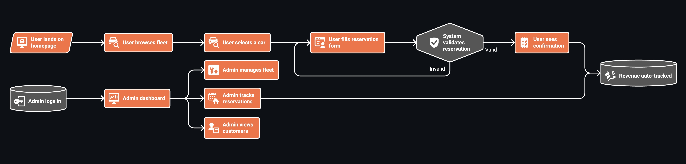

# Rent-a-Car Service


Rent-a-Car Service is a car rental platform built with ASP.NET Core MVC. It
lets customers discover vehicles, submit booking requests, and receive instant
confirmations — all through a dark-themed Tailwind interface.

The solution covers both sides of the counter: a customer-facing storefront for
browsing the fleet and placing reservations, plus an admin area where fleet
inventory, bookings, customer records, and income are tracked from a single
dashboard.

## Visual Overview

<p align="center">
  
</p>

## About

This project answers a straightforward business need: help customers find the
right car and book it with minimal friction.

It transforms raw database tables into an intuitive experience that includes:

- Curated vehicle showcase on the landing page
- Individual car pages packed with specs and photo galleries
- Multi-step reservation wizard with date and location picking
- Booking success page with a clear summary
- Back-office panel covering fleet, reservations, customers, and earnings
- Lightweight authentication using server-side sessions

## How It Works

1. `Program.cs` wires up SQLite, session state, and populates the fleet and
   province catalog on first run.
2. `HomeController` presents featured vehicles and a province dropdown to kick
   off the booking flow.
3. `CarsController` serves the full inventory list and single-car views
   complete with an image carousel.
4. `ReservationsController` validates availability, checks date conflicts, and
   creates both a customer record and a reservation in one shot.
5. `AdminController` surfaces key metrics — fleet size, active bookings,
   customer count, total revenue — and provides CRUD operations for cars.
6. `AccountController` handles sign-in and sign-out using in-memory session
   state with hard-coded credentials.
7. `SampleDataService` encapsulates all data-access logic, querying and
   mutating entities through the EF Core-backed `ApplicationDbContext`.

## Features

- Vehicle catalog with rich detail views and photo galleries
- End-to-end reservation flow with automatic customer registration
- Date-range conflict detection before confirming a booking
- Fleet administration (create, update, remove vehicles)
- Booking lifecycle management (Pending → Confirmed → Completed / Cancelled)
- Customer directory with per-person reservation history
- Revenue auto-logging when a reservation is confirmed
- Session-powered admin authentication
- EF Core migrations backed by SQLite
- Tailwind CSS dark-mode UI with responsive design

## Preview

<p align="center">
  
</p>

## Getting Started

### Prerequisites

- .NET 10 SDK
- A web browser

### Installation

Clone the repository and open the project directory:

```bash
git clone https://github.com/clssadik/rent-a-car-service.git
cd rent-a-car-service
```

Restore dependencies:

```bash
dotnet restore
```

## Configuration

The application uses a SQLite database configured in `appsettings.json`:

```json
{
  "ConnectionStrings": {
    "DefaultConnection": "Data Source=MeurentDb.db"
  }
}
```

The database is created and migrated automatically on startup. Sample cars and
Turkish provinces are seeded if they do not already exist.

The default admin credentials are configured in `AccountController`:

- **Email:** `admin@meurent.com`
- **Password:** `123456`

## Run

Run the application from the project root:

```bash
dotnet run
```

When the application starts, it applies pending migrations, seeds sample data,
and opens the website at the configured URL.

## Project Structure

```text
.
|-- Controllers/
|   |-- HomeController.cs          # Homepage and about page
|   |-- CarsController.cs          # Car listing, details, and reviews
|   |-- ReservationsController.cs  # Reservation creation and confirmation
|   |-- AdminController.cs         # Admin dashboard and fleet management
|   `-- AccountController.cs       # Admin login and logout
|-- Data/
|   `-- ApplicationDbContext.cs    # EF Core DbContext with model configuration
|-- Models/
|   |-- Car.cs                     # Car entity
|   |-- Customer.cs                # Customer entity
|   |-- Reservation.cs             # Reservation entity
|   |-- Revenue.cs                 # Revenue tracking entity
|   `-- Province.cs                # Turkish province entity
|-- Services/
|   `-- SampleDataService.cs       # Data access layer for all entities
|-- ViewModels/
|   |-- AdminCarFormViewModel.cs
|   |-- AdminCarsViewModel.cs
|   |-- AdminCustomersViewModel.cs
|   |-- AdminDashboardViewModel.cs
|   |-- AdminReservationsViewModel.cs
|   |-- CarsIndexViewModel.cs
|   |-- LoginViewModel.cs
|   |-- ReservationCreateViewModel.cs
|   |-- ReservationSuccessViewModel.cs
|   `-- ReservationSummaryViewModel.cs
|-- Views/
|   |-- Home/                      # Homepage and about views
|   |-- Cars/                      # Car listing and detail views
|   |-- Reservations/              # Reservation form and success views
|   |-- Admin/                     # Admin panel views
|   |-- Account/                   # Login view
|   `-- Shared/                    # Layout and partial views
|-- wwwroot/
|   |-- css/                       # Stylesheets
|   `-- images/                    # Static images and car photos
|-- Program.cs                     # Application entry point and configuration
|-- appsettings.json               # Database connection string
|-- rent-a-car-service.csproj      # Project file and package references
`-- README.md
```

## License

This project is licensed under the MIT License. See `LICENSE` for details.
